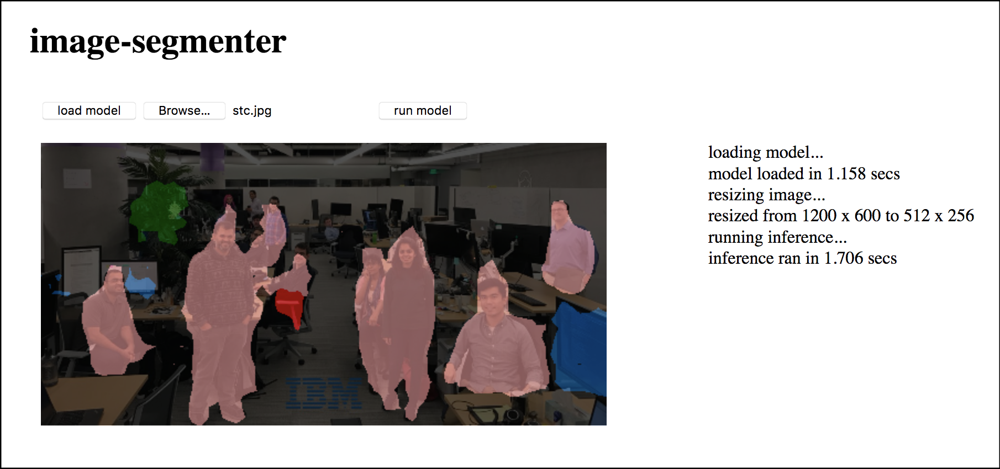

## Image Segmenter Demo

To run the demo:

1. Clone this repository

1. Point your web server to the `image-segmenter` directory in the cloned repo

    > For example:  
    > - using the **[Web Server for Chrome](https://github.com/kzahel/web-server-chrome)** extension (install it from the [Chrome Web Store](https://chrome.google.com/webstore/detail/web-server-for-chrome/ofhbbkphhbklhfoeikjpcbhemlocgigb))
    >   
    >   1. Go to your Chrome browser's Apps page (chrome://apps)
    >   1. Click on the **Web Server**
    >   1. From the Web Server, click **CHOOSE FOLDER** and browse to the `image-segmenter` directory in the cloned repo
    >   1. Start the Web Server
    >   1. Make note of the **Web Server URL(s)** (e.g., http://127.0.0.1:8887)
    >   
    > - using the **[SimpleHTTPServer](https://docs.python.org/2/library/simplehttpserver.html)** module (available in Python 2.x)
    >   
    >   1. From a terminal shell, go to the `image-segmenter` directory in the cloned repo
    >   1. Enter the command: `python -m SimpleHTTPServer 8080` (or whatever port desired)
    >   1. Once started the Web Server URL should be http://127.0.0.1:8080 (or whatever port used)
    >   
    > - using the **[http.server](https://docs.python.org/3/library/http.server.html)** module (available in Python 3.x)
    >   
    >   1. From a terminal shell, go to the `image-segmenter` directory in the cloned repo
    >   1. Enter the command: `python -m http.server 8080` (or whatever port desired)
    >   1. Once started the Web Server URL should be http://127.0.0.1:8080 (or whatever port used)
    >   

1. From the browser, access `demo/image-segmenter.html` via the web server's URL (e.g., http://127.0.0.1:8080/demo/image-segmenter.html)

    

