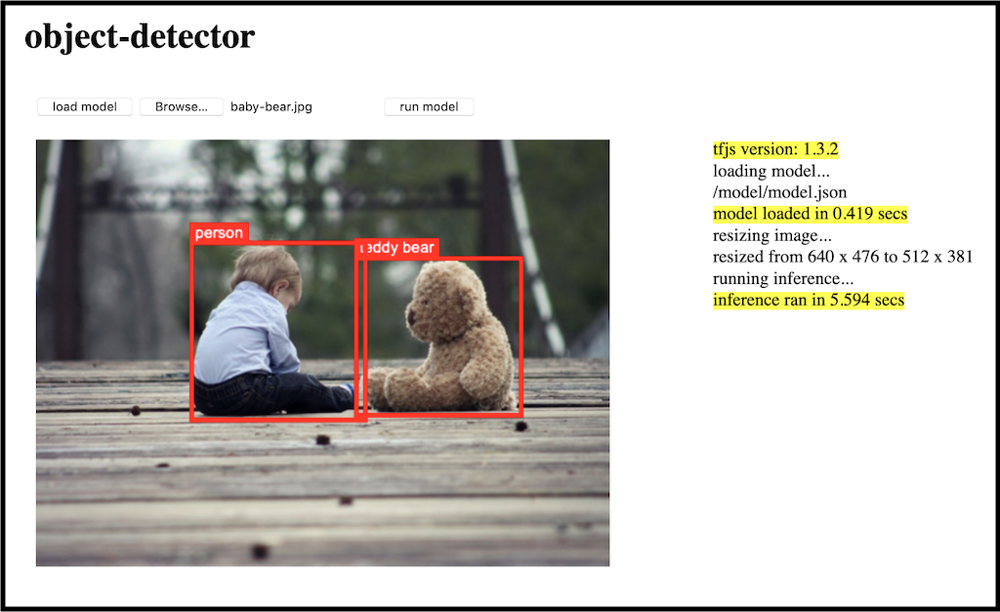

## Object Detector Demo

To run the demo:

1. Clone this repository

1. Point your web server to the `object-detector` directory in the cloned repo

    > For example:  
    > - using the **[Web Server for Chrome](https://github.com/kzahel/web-server-chrome)** extension (install it from the [Chrome Web Store](https://chrome.google.com/webstore/detail/web-server-for-chrome/ofhbbkphhbklhfoeikjpcbhemlocgigb))
    >   
    >   1. Go to your Chrome browser's Apps page (chrome://apps)
    >   1. Click on the **Web Server**
    >   1. From the Web Server, click **CHOOSE FOLDER** and browse to the `object-detector` directory in the cloned repo
    >   1. Start the Web Server
    >   1. Make note of the **Web Server URL(s)** (e.g., http://127.0.0.1:8887)
    >   
    > - using the Python **HTTP server** module
    >   
    >   1. From a terminal shell, go to the `object-detector` directory in the cloned repo
    >   1. Depending on your Python version, enter one of the following commands:
    >       - Python 2.x: `python -m SimpleHTTPServer 8080`
    >       - Python 3.x: `python -m http.server 8080`
    >   1. Once started, the Web Server URL should be http://127.0.0.1:8080
    >   

1. From the browser, access `demo/object-detector.html` via the Web Server's URL (e.g., http://127.0.0.1:8080/demo/object-detector.html)

    
